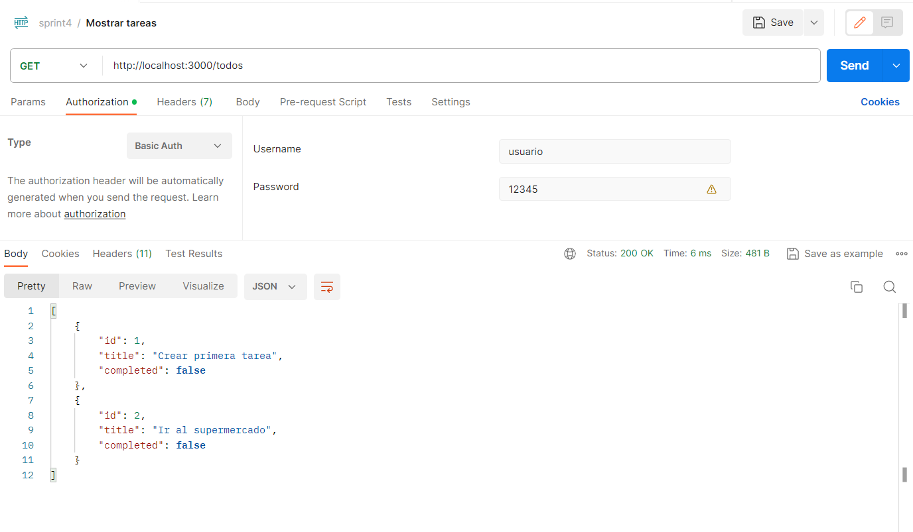

# Sprint 4: REST API
---
## Descripción

En este sprint 4 se trata de crear un servicor utilizando Express.jss para proporcionar servicio a la API REST de la lista de tareas (TODO-LIST). Se deben implementar las funcionalidades siguientes:

- Mostrar la lista de tareas (http://localhost:3000/todos)
- Añadir una nueva tarea a la lista. (http://localhost:3000/todos)
- Marcar una tarea como completada. (http://localhost:3000/todos/:id)
- Eliminar una tarea de la lista. (http://localhost:3000/todos/:id)

Para hacer las comprobaciones sobre su correcto funcionamiento he utilizado Postman.

---
## Postman

Primero de todo, ejecuto en terminal lo siguiente `npm run run` siendo run un script detallado en mi package.json que se refiere a `node dist/app.js`.

Entonces nos dirá: Server is running on port 3000

Ahora en postman:

Primero debemos introducir en la pestaña 'Auth' y con type ''Basic Auth' un usuario y contraseña en el header de la petición para realizar una autentificación básica. En este caso el nombre de usuario es 'usuario' y la contraseña es '12345'.

Si enviamos sin rellenar la información o con el usuario o contraseña incorrectos y pulsemos en 'Send', nos devolverá 'HTTP Status 401 - Unauthorized'.

Cuando pongamos el usuario y contraseña correctamente y enviemos a send, hará la función que toca según el endpoint en el que nos encontremos. Esto debe hacerse en cada uno de los endpoints, en este caso son 4:

{width=50%}

Además, se ha añadido un middleware que añade el header de Cache-control: no-cache para indicar a los navegadores y a otros intermediarios que no deben almacenar en caché la respuesta de una solicitud, aunque existe la posibilidad siempre y cuando se valide con el servidor antes de entregarla al cliente.

{width=75%}

### Funcionalidades

Ahora vamos a comprobar las cuatro funcionalidades (GET, POST, PUT, DELETE) en postman:

- GET: Nos devuelve la lista de tareas introducidas hasta el momento, si no hemos introducido ninguna, nos devolvera un array vacío.

{width=75%}

- POST: Crea una tarea, vamos a la pestaña body y escribimos el cuerpo de la solicitud en un formato JSON, indicando el id de la tarea, el título (title) y su estado (completed). Le damos a 'Send' y creará la tera y nos la mostrará.

{width=75%}

Ahora al solicitar GET, nos devolverá un array con todas las tareas que hayamos creado:

- PUT: Actualizar una tarea. Para ello, debemos indicar el id en la URL y poner en el cuerpo de la solicitud (pestaña body) la tarea en formato JSON con la modificación que deseemos. Por ejemplo para marcar como completada la tarea con id 3 "Ir al gym".

- DELETE: Elimina una tarea de la lista, hay que poner el id en la URL, darle a 'Send' y la tarea se eliminará de la lista.

Ahora si ejecutamos GET, devolverá la lista actualizada:

---

### Herramientas

Para llevar a cabo este sprint he instalado las siguientes dependencias en mi proyecto:

- express --> `npm install express`
- express-basic-auth --> `npm i express-basic-auth`
- body-parser --> `npm i body-parser`
- cors --> `npm i cors`
- @types/express --> `npm i @types/express`
- @types/node --> `npm i @types/node`